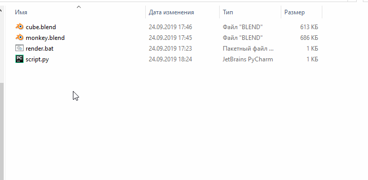
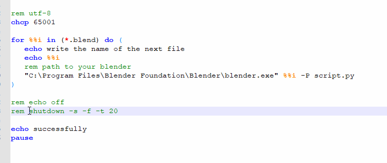

# blender_batch_render

Крошечный скрипт, чтобы рендерить все ваши .blend файлы в "один клик".
Этот скрипт полезен тем, если у вас накопилось много разных проектов, которые нужно отрендерить. Теперь вы можете запустить этот скрипт ночью и он будет открывать файлы для рендеринга, не нарушая ваш сон;) **только для windows** 

### Использование
Чтобы начать рендеринг, вы должны скопировать `script.py` и `render.bat` в папку c `.blend` файлами

Теперь просто запустите `render.bat` от имени администратора.


### Настройки
Для того, чтобы выключить компьютер после рендеринга вам нужно раскомментировать строку, удалив слово `rem` в `render.bat`

```bat
shutdown -s -f -t 20
```
Вы можете рендрить в фоновом режиме (часто используется для визуализации без пользовательского интерфейса), добавив флаг `-b`

```bat
 "C:\Program Files\Blender Foundation\Blender\blender.exe" %%i -P script.py -b
```


#### Предупреждение
* Если у вас установлен blender в другой папке, измените путь в `render.bat` 
* opengl и eevee не поддерживают рендер в фоновом режиме

### поддержка 
Windows 
Blender 2.8x 
